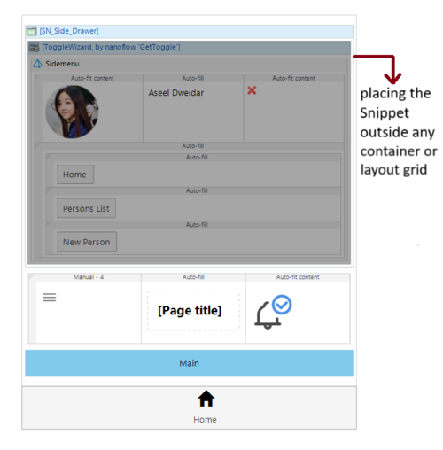
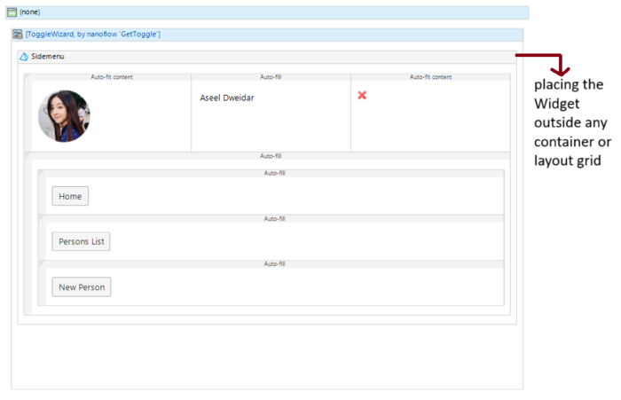
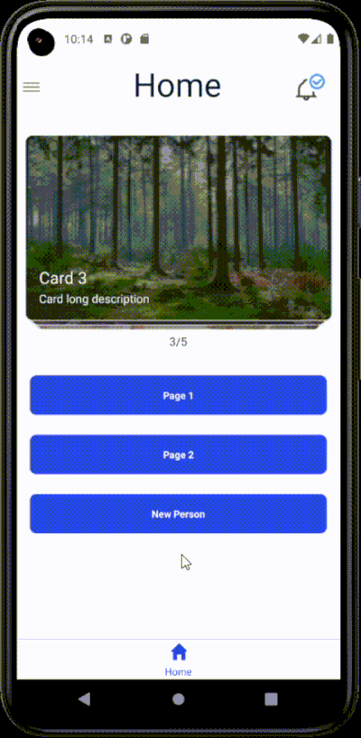

# Native Side Drawer / Menu

### PLEASE READ THE DOCUMENTATION CAREFULLY BEFORE USING THE WIDGET ⇓ ⇓ ⇓

## How to Use

1. Darg and drop the widget on the layout header **(outside any container or layout)**, see the images below.
2. Covert the widget to a snippet to add the dataview -in order to add "Is Open" attribute-.
3. Configure the 'Is Open' attribute, which controls the toggling of the drawer. And set up the action for closing the drawer when the overlay is clicked or when the drawer is swiped. **Be aware that if the 'Is Open' attribute is unavailable, the drawer will stay in a closed position**
4. Setup the remain widget's properties as needed and add any content inside the content box of the widget.

## Issues, suggestions

* ### 🗙🗙🗙 Avoid placing the widget within a container or a layout grid, as this will crash the widget. However, it can be positioned inside a dataview.
* ### The Z-index value for the widget is set at 10000. Be mindful that if you choose to use a higher Z-index value for your content, it may overlap or obscure the widget.
* ### Ensure that you use valid colors for both the drawer and the overlay background, or keep the default values, to avoid any potential rendering problems. Also you can use a color with transparency.







## Features

* Dynamic content.
* Left or right alignment.
* Close drawer on swipe or overlay click.
* Flexible width and Menu/overlay colors.

## Development and contribution

```
    $ cd [cloned widget folder]
    $ npm install
    $ npm run build
    <!-- will bundle the project in root level for this project, in a widget folder -->

    <!-- node version 16.17.1 -->
```

***************
 LinkedIn [Aseel Dweedar](https://www.linkedin.com/in/aseel-dweedar)